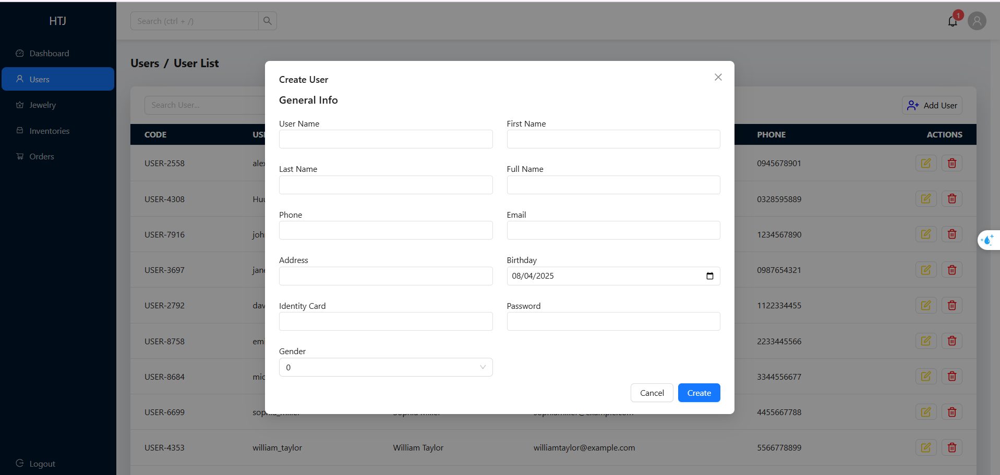

# JMS-Backend

Jewelry-Management-System

## Overview

JMS-Backend is an ASP.NET Core Web API project designed to manage a jewelry management system. This project provides various endpoints to handle operations related to jewelry inventory, sales, and customer management.

## Features

- **User Management**: Manage customer information and track customer purchases.
- **Inventory Management**: Manage inventory, including adding, updating, and deleting inventory.
- **Jewelry Management**: Manage jewelry items, including adding, updating, and deleting items.
- **Orders Management**: Handle orders transactions, including creating and viewing order records.
- **Authentication and Authorization**: Secure API endpoints using JWT authentication.
- **Logging**: Integrated logging using NLog.
- **Swagger**: API documentation and testing using Swagger.

## Prerequisites

- [.NET 6.0 SDK](https://dotnet.microsoft.com/download/dotnet/6.0)
- [Docker](https://www.docker.com/get-started)
- [SQL Server](https://www.microsoft.com/en-us/sql-server/sql-server-downloads)
- [NLog](https://nlog-project.org/)
- [JWT Authentication](https://jwt.io/)
- [Swagger](https://swagger.io/)

## Getting Started

### Clone the Repository

```sh
git clone https://github.com/HuuTri130401/JMS-Backend.git
cd JMS-Backend
```

### Using Docker
1. Build the Docker image:
```sh
docker-compose build
```

2. Run the Docker containers:
```sh
docker-compose up
```

3. Access the API at:
```sh
 http://localhost:5000/swagger/index.html
```

### Screenshots

User Management

Create User


Update User


Users List


Inventory Management

Create Inventory


Inventory List


Inventory Detail


Jewelry Management

Create Jewelry


Edit, Approve and Update Jewelry


Delete Jewelry


Jewelry List


Orders Management

Create Order


Order Detail


Authentication and Authorization

Login
